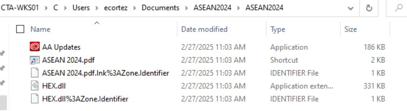
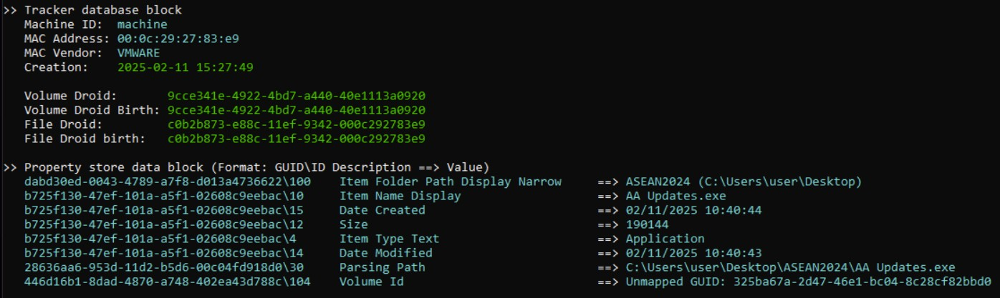
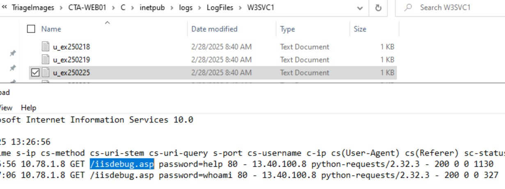
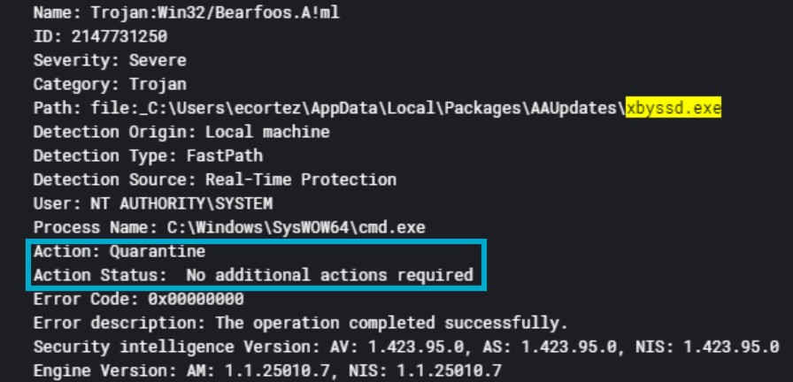

# Xintra's Council of Tropical Affairs Lab Walkthrough

Writing up a walkthrough to figuring out the incident at XINTRA's Council of Tropical Affairs Lab.   This lab is an emulation of the threat actor, Mustang Panda, conducting a cyberespionage attack against a Southeast Asian government. 

## Section 1: Understanding the network
It's a relatively straight forward network, but choosing to look into each of the zones individually and see what/where things might possibly exist.

### 1a. The DMZ
First section of the network to grasp first: the DMZ. 

As the DMZ is the intermediate link between the Council's intranet and the external internet, the servers seen here makes a lot of sense. CTA-WEB01, a Windows Server 2019 IIS that hosts the council's website as shown: `http://tropicalcouncil.com`. Chances are, being a government entity, it would be publishing announcements, having contact emails there for people to reach out to and the like. 

Together with that, CTA-MX01 (10.78.1.9), a Mail Exchange server: for receiving incoming mail from the internet and might also allow secure remote access (via Outlook Web Access or mobile sync). Suppose, if CTA-WEB01 website has a 'Contact Us' form, that form submission might get converted as an email and sent over to CTA-MX01. In order for this to work, CTA-MX01 must allow SMTP relay from CTA-WEB01's IP (10.78.1.8) — securely and within policy. 

### 1b. The Workstations

Next up, the workstations of the staff at this office. 

It's been understood that employees Elena Cortez and Mako Reeves reported an unusual email on February 20, 2025. In the provided diagram, we can see Elena Cortez's workstation, and another colleague's.  We'll pivot back into this when solving the lab. 

### 1c. The Servers

Following that, the servers. 

Here, we see a Domain Controller (CTA-DC01), File Server (CTA-FS01) and Proxy Server (CTA-PRX01). 

Like other labs, the Domain Controller (CTA-DC01) will be responsible for the workstations to authenticate with the Domain Controller, and look after respective user logins, enforce group policies the employees' user accounts will need to align with. 

In the case of the File Server (CTA-FS01), it would assist with shared file storage and backups for the employees to store and access documents. 

Lastly, the Proxy Server (CTA-PRX01). Amongst these, only CTA-PRX01 is interacting with the internet. Chances are it is likely assist with Internet Access filtering and monitoring. Route all web traffic from workstations through a secure proxy, and apply any sort of web filtering policies as needed. Possibly, it will also include logging of user's web activity for audit and incident response. 

### 1d. Backend section of the network

Lastly, the backend section of the network. 

It comprises of a Jump Host and an ELK server. The previous time a Jump Host was seen is in the Waifu University case study. It is meant to act as a controlled entry point into the backend network for admins. However, we can also see an ELK Stack (Docker) inside the Jumphost too. Something to think about: as this server could be serving more than one purpose: 

i. As a secure access point to the backend/internal network. </li>

ii. As a log collector or analyzer, likely to collect logs from other machines or support incident investigation. </li>

iii. Possibly used by analysts/admins to access ELK data without touching the ELK server directly. </li>

The ELK server would be collecting logs from the components thus far, and would not need to be exposed to the internet. 

And with that, onward to solving the lab! 

## Section 2: Lab Walkthrough

### Section 2a: ASEAN Infiltration
Based on the scoping notes, it's understood that an unusual email was reported on February 20, 2025. Pivoting into this, let's take a look at each of their individual mailboxes and see what could be there. Take note, the date of reporting that funny email is Feb 20, 2025. That means, it's an email they either received on the day itself, or earlier. 

With that, let's look into both employees' mailboxes. One common email they've received is this one from a 'jeelhertzo@asia-commercial.com'. Interestingly, this is not visible in the other employees' mailboxes, and it only exists in Cortez's and Reeves' mailboxes. 

The email contains an attachment `ASEAN2024.zip` and allegedly speaks of a password protected PDF file that should be extracted to the desktop. Now that we know it only specifically got sent to Elena Cortez and Mako Reeves, the next step is to see which of these users utilise the workstations we've seen from the above network. 

Inspecting the triages, we can see that ecortez is a user in CTA-WKS01. There's no immediate evidence showing Mako using either of the workstations' based on the triages. Chances are, if any interaction of the zip folder might've happened, it could be from CTA-WKS01. 

Inspecting further, we do see the malicious zip folder being part of ecortez's Documents. 

To figure out the time it was downloaded, it can be inspected from the $MFT file of CTA-WKS01 with the following command: `MFTECmd.exe -f "Path\to\$MFT" --csv "Path\to\store\result" --csvf "any_result_name.csv"` (after extracting out the EricZimmerman's MFTECmd tool). 

With regard to file download, the timestamp that's of interest amongst these columns is the 'Last Record Change' timestamp. The explainer for the MACB timestamp variations can be found [here](https://www.youtube.com/watch?v=OTea54BelTg&t=1s). When distinguishing between which timestamp to use, the 0x30 or the 0x10 variant, that is explained in another [video](https://youtu.be/_qElVZJqlGY?si=sBeQ00lpTj52S4Vo&t=844)

The 0x30 is more specific to the times registered by the kernel of the file being downloaded, and hence, that would be the more appropriate one. 

Back to the original file: as seen in the documents above, from the triage, the ASEAN2024.zip has been extracted. Let's see what's inside it. 

In it, there's a .lnk file, an .exe file called "AA Updates" and a "HEX.dll". To get more information about the threat actor's host, amongst the three that are there, it's the .lnk file that might hold a possible answer. So, by using Eric Zimmerman's LECmd tool, we get this:

It actually indicates the MAC address and device details of the workstation the zip file got saved into. However, don't clear off these results yet. To get the actual threat actor's details, we need to extract the .lnk file out of the zip file from the email itself. Thankfully, with the XstReader tool, we can save the original attachment from the original email sent over. 

Saving the original .lnk file in an isolated folder, and using LECmd on it, let's see if the results vary. As the lab had a Temporary Files folder, opted to extract the files out there, and copy that path down into the command line: `LECmd.exe -f "C:\Path\Over\to\Temporary Files\ASEAN2024\ASEAN 2024.pdf.lnk"`

Now, from the original zip from the email, we can see the original TA machine's MAC address. 

At this point, it's good to take stock of the indicators we have so far: 
1. The first email came in on 20th Feb 2025, 10:09:09AM
2. The Zip file was fully downloaded onto the CTA-WKS01 computer at 20th Feb 2025, 10:23:28AM

Furthermore, when visiting back the terminal results from the copy of the zip in ecortez's Documents folder, there's this nugget:

The malicious executable that was part of the zip folder has a last access time of 20th Feb 2025, 10:25:06AM. In the context of an executable file, it can include... executing it. So that means this `AA Updates.exe` was a file that ran in the ecortez's workstation. Likely, from this point in time onwards, more processes might have spawned or other things might have happened. To inspect that, we should switch into the ELK logs captured. 

So, the first thing to do is to filter off the logs enough, and with the appropriate columns to verify what `AA Updates.exe` is up to after it was executed. 

Having a look at the codes and knowing that the process.executable should be referring to our `AA Updates.exe`, the most appropriate events to look at is when event.code == 8. These have a RuleName to detect out Process Injection, and should be looked at to see the processes the threat actor injected into. 

Thus, it's noted that there were 2 explicit processes the threat actor injected into. Having a look at the TargetImage field, we can keep note of the processes `AA Updates.exe` injected itself into: OneDrive.exe and Microsoft.Windows.Photos_2024.11120.5010.0_x64__8wekyb3d8bbwe\Photos.exe . It's also good to take note of their timestamps as well: 10:54:45am and 10:59:47am respectively

Now reverting to what we've seen from the threat actor zip file, one file we didn't fully account for yet, is the HEX.dll. Typically, if there is some kind of DLL originating from a threat actor's artifact itself, chances are it's tailored to do something with whatever executable they've designed as well. 

Hence, let's try and narrow out our logs to HEX.dll, within the same day, and see if anything else emerges. 

As a result, we can see that for those same timestamps for the process injections, events involving HEX.dll get registered as well. 

When analysing the fields of these logs also, the field: rule.name also hints it's a DLL Injection. So we can conclude that HEX.dll that was loaded into the malicious payload, AA Updates.exe, too. 

When proceeding on to the lab from here on, it would be useful to create a starting point for the logs at Feb 20th 2025, 10:54:45AM. It's from here we could potentially see the chaos these files would like to unleash into the systems. 

To the logs view: I opted to add on the registry.key and registry.value columns, and have a look at what might spring. To ensure persistence in a system, after their payload got executed, a registry key's value would've been modified. 

After browsing through the logs, and removing a bulk of default values, and ensuring both columns' values are existing. With a quick filter, we can see the registry value of 'Adobe Updater'. 

And that concludes the first section of the lab: ASEAN Infiltration. 

### Section 2b: Understanding the Tropics
So far, recaping back on what's be uncovered: 

We know:  
1. Funny Email was sent at 20th Feb 2025, 10:09am
2. The Zip file being downloaded onto ecortez's desktop happened at 10:23:28AM
3. The malicious executable, AA Updates.exe, had a last access time (therefore last executed time), of 10:25:06AM
4. After execution, it injected into 2 different processes at 10:54:45AM (OneDrive.exe) and 10:59:47AM (MS....Photos.exe) respectively, and a DLL being sideloaded into these too. 
5. A Registry value being modified at 20th Feb 2025, 11:19:50AM, to maintain persistence within the CTA-WKS01 device.

To proceed with the next part, I decided to filter the logs from #4 onwards, from the time the first process, OneDrive.exe, was injected into, and having the initial process, `AA Updates.exe` still be part of our filter. When looking through that filtered activity, we can see a lot of attempts at a network connection occuring too (denoted by event.code == 3). This event code gets specifically triggered when it is made from a process - our `AA Updates.exe` process AND when the connection is outbound (out of the victim device). We'll keep this in the backburner to revisit soon. 

Referring back from the image above, it is also good to note its process ID is 9,320. 

Onwards with the lab: in this section, the goal is to find an Active Directory enumeration tool the threat actor had utilised. When looking up what these can potentially be, one thing that is often quoted are sample commands. Therefore, the first train of thought had been to look up "cmd.exe" in the process.name or process.command_line fields. 

After looking through the values of that column, a potential suspicious one pops up. 

When breaking down the command that was witnessed here: `C:\Windows\system32\cmd.exe /C a.logs -b dc=gotham,dc=lab -f "objectcategory=computer" cn createTimeStamp >> Domain_computers_light.txt`, a rough explainer of this is: 

| Part                            | Explanation                                                                                                                                                |
| ------------------------------- | ---------------------------------------------------------------------------------------------------------------------------------------------------------- |
| `C:\Windows\system32\cmd.exe`   | This is the full path to the Windows command interpreter (`cmd.exe`).                                                                                      |
| `/C`                            | Tells `cmd.exe` to **run the command that follows** and then exit.                                                                                         |
| `a.logs`                        | Presumably a **custom script or binary**, not a standard Windows tool. Possibly used to query Active Directory or logs.                                    |
| `-b dc=gotham,dc=lab`           | Likely specifies the **base DN (Distinguished Name)** in LDAP format — this sets the root of the directory tree to search (i.e., the `gotham.lab` domain). |
| `-f "objectcategory=computer"`  | Applies a **filter** to search only for objects in Active Directory where the `objectcategory` is `computer`.                                              |
| `cn createTimeStamp`            | Likely instructs the tool to **return the `cn` (common name)** and **`createTimeStamp`** attributes for each matching object.                              |
| `>> Domain_computers_light.txt` | Appends the output to a text file named `Domain_computers_light.txt`. If the file doesn’t exist, it will be created.                                       |

Thus, we can tell the tool that was finally used as `a.logs` and it ran a query on the gotham.lab Active Directory domain. We see the same command gets repeated with the CTA domains. 

But to backtrack a little, let's see what the tool's original name was before it got named as a.logs. When having a look at all the logs in ELK relating to `a.logs` across the entire lab duration. To this table, I added in the new field 'file.pe.original_file_name' to see if any results appear. 

Thus far, we can see that `a.logs`'s original file name is AdFind.exe. 

And that concludes this section of the lab, Understanding the Tropics. 

### Section 2c: Island Hopping. 

Onwards to this next section of the lab. For this, opting to start from where we had left off in finding `a.logs` in ELK, and all the commands that were executed with it to find more Active Directory details. 

Having a look at a subset of the commands, here's the rough timestamps, and the AD domains that were queried. 

After the first command, all others are run in the CTA domain. In the **objectcategory** field of the command, there are a total of three different values: computer, group and user. 

Let's take a deeper look at each of their commands:  

| Command Focus           | Computers                      | Users                                          | Groups                        |
| ------------------ | ------------------------------ | ---------------------------------------------- | ----------------------------- |
| objectcategory Value        | `computer`      | `user`                          | `group`        |
| Queried features | name, creation timestamp | identity, email, timestamps, logon, descriptions | Group metadata + memberships  |
| Output Filename    | `Domain_computers_light.txt`   | `Domain_users_light.txt`                       | `Domain_groups_light.txt`     |
| Purpose            | Inventory of devices           | Audit of users                                 | Group policy/security mapping |

Looking at what these commands, chances are it's after the user-styled command, the threat actor might have logged into the network. Taking note from the above image, that was executed on Feb 21, 2025 at 10:28:14AM-ish. Let's see from our event.code column, after that, if any successful logons have occured. 

But take note, we know that these commands were executed in CTA-WKS01. Why can this work; when WKS01, is configured to authenticate against the CTA-DC01 Domain Controller for its respective users, policies and files/data, executing AdFind.exe on it, will return the whole domain's details, even when some of the details about it can be irrelevant to itself as a workstation?

That is because, from our network in question, it is domain-joined (joined by CTA as a domain). When a workstation, like WKS01, runs a query with AdFind, it forwards the query to the Domain Controller via LDAP (Lightweight Directory Access Protocol). By design, Active Directory is designed with centralised management - every domain-joined device, like CTA-WKS01, should know which users exist, the groups they're in, and the appropriate policy to apply on them. By default, AD is **globally readable by default** when it was designed by Microsoft. Furthermore, Active Directory's LDAP queries, do not filter results automatically per machine. 

That's why, from the above, the actor is able to make use of this principle, and pipe all the results they're keen to achieve into those distinct text files.

Having understood this Active Directory design principle, let's proceed with the lab. The lab hints at a successful brute forced login of Active Directory. Therefore, from our CTA network diagram, the best logs to look into are of CTA-DC01, and see any successful logins associated with Active Directory. For a brute force to have been successful, we now need to delve into what protocols Active Directory utilises to authenticate and give access to users. Two popular tactics include Kerberos and NT LAN Manager. 

To condense what to look for amongst the ELK Logs, I looked into what potential event IDs exist that mention Kerberos and it's steps for logging in successfully. Here's the godsend [source](https://www.ultimatewindowssecurity.com/securitylog/encyclopedia/default.aspx?i=j)

Having a look at all these values, and since the lab gave a context of a brute force happening before being able to successfully login, the event codes that make sense to look into are:  

i. 4771 -- Kerberos pre-authentication failed  
ii. 4768 -- A Kerberos authentication Ticket (TGT) was requested  

Looking into how these values would be logged by ELK, the key thing to look for is a successful 4768, after a series of 4771's, if a brute force was executed against various usernames. 

After that's done, the next thing was to check the field statistics of the usernames that are in this subset of 4771 and 4768 event ID logs. Against that, to check against each username, whereby both values were present like so:

Intriguingly, from statistics alone, the next username, `dataflowsvc`, might have been a promising candidate. After forcing the user.name ELK field to be equal to that, its ELK logs started to look interesting. 

When zooming in on where this singular 4768 log was amongst the numerous 4771, it can be logged at Feb 21, 2025, at around 4pm. 

Looking through a number of the preceeding 4771 logs around the 4768 one, and zooming in on the Failure Code value from the message: it can be seen that there were multiple bad attempts with a bad password. 

Now, onto the singular 4768 log: when looking back at [this source on Windows Security Event Logs](https://www.ultimatewindowssecurity.com/securitylog/encyclopedia/event.aspx?eventid=4768), there's an explainer here on how or what gets logged as a successful TGT being requested. 

Given the series of 4771's that had occurred all throughout until one 4768 event, highly likely, `dataflowsvc` was the account's credentials the threat actor had guessed correctly by brute forcing. From here, let's see what happened next. 

For reference, this successful login into CTA-DC01 as `dataflowsvc` happened on Feb 21, 2025, at 16:00:53. 

It is from here, we can begin to understand what else the TA would've done under this username. 

Therefore, the ELK's logs can become reset to Feb 21 2025, 16:00:53 to the end of the lab, to see what this TA was up to. When looking at the logs, it's visible that the TA continued on with trying more credentials despite the successful 4768 event at the timestamp. Removing those, we can see where else they might have traversed once they were in the system. 

Scrolling across the logs, we can see the TA try the credentials into other components of the CoTA network, and we begin to see some commands getting executed. Now adding in the command_line ELK fields, we're seeing more activity: 

Seeing the first visible log with a command_line argument. From the message, we can see that the TTP highlights the use of Windows Management Instrumentation. 

When expanding that log further, it's command_line value is of interest: 

This was quite a strange value to witness as a command line value, so it required a bit more hunting. 

`cmd.exe /Q /c cd \ 1> \\127.0.0.1\ADMIN$\__1740155137.44594 2>&1`

This [blog](https://www.varonis.com/blog/wmi-windows-management-instrumentation) helped a bit in finding more about how WMI can be abused into, quite specifically, as a tool to surveil other employees. It later talks about 'Impacket' Wmiexec, a tool from a Pythonic package. And the command above matches how WMI's abused to remotely spawn a process. It also matches the fact that the event.code for this log is also 1. 

Afterwards, the lab confirms that the TA pivoted into the Mail Exchange server, MX-01. That had started to become visible since removing the unsuccessful 4771 Kerberos logs. In order to pivot into MX-01, a service had been created, and that was the next thing to look up. 

Narrowing the agent.name down to CTA-MX01, we need to see how or what service might be inside CTA-MX01. Looking inside that [Windows Event Logs source again](https://www.ultimatewindowssecurity.com/securitylog/encyclopedia/), some potential event logs were encountered: 

Highly likely, it's event ID 4697 that might possibly hint at the service that was useful for the threat actor. 

Sure enough, we see a service that mirrors what we could be looking for. `AdobeUpdater` is the service that was installed into system. 

Looking up more details on this log, we can see the familiar AAUpdates.exe that had come from the first ASEAN2024.zip folder. That malicious binary had moved to a new folder. 

However, this file movement, has been quite puzzling. To try and decipher some things out, I opted to look up the logs that were 5 mins before and after the first time `AdobeUpdater` the service was installed the first time (at 9:40am, Feb 24 2025). 

Just before the installation of the service, there's a series of 5145 events. Looking back at our [godsend source](https://www.ultimatewindowssecurity.com/securitylog/encyclopedia/), event 5145 means to check whether a client is allowed to access a file/folder on a shared resource. 

Somehow, by a stroke of luck, the very first log, we can see this in the message portion of the log: 

In essence, under the guise of the dataflowsvc account, the TA tried to access the hidden C$ administrative share on CTA-MX01 (10.78.1.9), and get a hand on the target file, 32HEX.dll. The access mask, 0x10080, is meant to request to ReadAttributes and DELETE off the file from the system. 

What this shows, is that 32HEX.dll, that was part of the phishing email that had come into CTA-WKS01, is now sitting in CTA-MX01, and is asked to be deleted there. While it's hard to decipher this movement very clearly, there is one potential hint: the $C from the log above. These are hidden Administrative shares created automatically in Windows. It's a resource that is exposed over the (potential) protocol Server Message Block. Hence, it becomes possible for the Threat Actor to drop in payloads into such "powerful" folders in the devices that are part of the victim's network. 

*Again, this idea that SMB had indeed been used to come from the phished CTA-WKS01 into the CTA-MX01, is just purely based on log inference.* What extra things to look for in the triages, and to confirm them all, is something that I'm personally unsure of at this point. 

And that concludes this Island Hopping section of the lab. Moving on to the next...

### Section 2d: Persisting in the Pacific
So at this point, we've understood that components from the ZIP folder, have also entered other components of the network - like CTA-MX01 (at roughly Feb 24 2025, 09:35:24am). Once the Threat Actor would've placed their malicious files in each component, the next thing to do is to ensure they remain in the environments, without being removed. 

For this, a system would have an anti-virus system that will trigger many events if it has found a malicious file in its system. Let's first start with checking these logs in CTA-MX01, as user `dataflowsvc`. 

Starting the logs from Feb 24 2025, 09:35am, there are some potential logs that indicate that the anti-virus system has been tampered with to allow for persistance. 

That's the first time that the Anti-Virus has been modified for the attack to come this far. 

Afterwards, the lab hints that a Webshell had been dropped to the web server, CTA-WEB01. For this, I opted to look into the evidence folders instead of the ELK logs this time. 

And intriguingly, there is a new folder of evidence called YaraScans - something I've not yet seen from the previous two labs. And luckily, looking into it, there's a nicely named file of all the YARA scans collected on WebShells. 

And within it, there's hits of a Webshell in the path of `C:\inetpub\wwwroot\iisdebug.asp`. 

Now, with this path discovered, and the time it has been deployed at, it's easier to look into it deeply in ELK, and see what commands the TA had done with its presence.

Since the webshell's path was known, the next thing to do is to look it up in the log files of CTA-WEB01. 

When navigating into the logs at this logs directory, there are 2 folders that are there: W3SVC1 and W3SVC2. 

The key to finding out the commands that were strictly conducted through our 'issdebug.asp' webshell is to see if the field in 'cs-uri-stem' is indeed that same value.

And looking at the files that were populated, there were 2 commands from it in 25/02/2025 and 11 commands from 26/02/2025. And all were attempting to communicate with the destination Threat Actor IP address, `13.40.100.8`. 

However, the lab is truly keen on the 11 commands from 26/02/2025, as the 25/02/2025 commands would've bordered feeling slightly like recon - more like a "is this working well?" type of commands. 

Whereas, when looking at the 11 commands from 26/02/2025:

| Raw IIS log |  Decoded command | Description / intent                                                                                                                            |
| --------------------------- | ---------------: | ----------------------------------------------------------------------------------------------------------------------------------------------- |
| `password=whoami+%2Fgroups` | `whoami /groups` | Enumerate the current account and its group memberships (checks if the process has administrative or privileged group membership).              |
| `password=dir`              |            `dir` | List directory contents of the current working directory.                                                                                       |
| `password=cd+C%3A%5C`       |         `cd C:\` | Change working directory to the root of the C: drive.                                                                                           |
| `password=dir`              |            `dir` | List contents of `C:\` (confirm what files/folders are present after changing directory).                                                       |
| `password=cd`               |             `cd` | Query or display the current working directory.                                                                                                 |
| `password=cd+C%24`          |          `cd C$` | Attempt to change to the administrative share `C$` (indicates the attacker is trying to access privileged/administrative filesystem locations). |

The 11 commands of the 26th Feb are the ones that indicate a Threat Actor actively choosing to enter privileged drives inside CTA-WEB01. 

And that concludes the section of Persisting in the Pacific. Onwards to the next one. 

### Section 2e: Cantaloupes and Coconuts (C2)
Thus far, we've managed to understand that the Threat Actor has traversed through the various devices in the network, and has tried to access or change privileged filesystem locations. Now, assuming they were keen to copy and exfiltrate whatever they liked back into their own system, some kind of C2 tool might have been used. And there is evidence of that visible in the folder where the previous Yara scans for Webshells were found. 

The keyword is "Beacon", in finding out the tool that was used to set up a C2 communication between the threat actor and the victim machine. In this scenario, it's making use of `Cobalt Strike` framework. Let's now look deeper into the the other specifics of the beacon. 

The first, is to find the domain it was meant to communicate to. For that, let's look back into the YaraProcessWin file, they indicate the Process IDs of the Cobalt Strike processes, and their numbers are 9840 and 14572. 

When looking into the Memory portion of the evidence collected, they're there as ProcessMemoryDumps. We can now parse these `.dmp` files into the CSCE application. 

The password for unzipping the folder is the previous question's answer, verbatim. Once that's done, two distinct dumps for both processes should become visible, and parse-friendly, and its results would begin to appear like so. 

The parsed dump shows us that the hostname domain is `feed-5613.codeformylife.info`. Afterwards, other details, like its IP address and such were not indicative in the results that appeared. The next thing to do, was to try and figure out the IP address that is under this domain. 

When looking up logs that strictly contained the entire domain in its URL, it is possible to see the IP address the C2 has resolved to. 

In the next question of this part of the lab, we get a hint that a pipe was created by a binary called `adobeupdatr.exe`. When looking up articles to make sense of it, I came across this [article](https://svch0st.medium.com/guide-to-named-pipes-and-hunting-for-cobalt-strike-pipes-dc46b2c5f575) by the Xintra Overlord who created this particular Council Lab. It helped explain the what pipes do, and their context in Cobalt Strike C2s. 

However, the goal is to find, the pipe that was found by a binary 'adobeupdatr.exe'. Indeed, when we narrow down the ELK logs to that value in the process.name column, a narrowed list of events with that process name appears, and a couple of pipe events are witnessed. 

But we should take a step back: why this particular binary called `adobeupdatr.exe`? Well, when looking across all the logs associated with it, we can see it is created in the path of "C:\ExchSecIns\srcdat". This was seen before from Island Hopping: when we figured out that files from the Phishing email had moved from CTA-WKS01 to CTA-MX01. 

It looks like from this particular folder, the pipe was made to be primarily used for SMB Beacon communication. Across the logs visible, two of them mention a pipe being created. And in both, the pipe is named as "\mojo.29468.24172.6507942173138232748". 

Following that, the next thing to see is what application this pipe name is associated with: we've seen from the article [above](https://svch0st.medium.com/guide-to-named-pipes-and-hunting-for-cobalt-strike-pipes-dc46b2c5f575), that every pipe made will have its associated name within it. In our case, pipes beginning with the word "mojo" meant it's for any Chromium-based application (ie: Google Chrome, Microsoft Edge). Essentially, the threat actor is trying to hide or tunnel activity through Chromium's legit IPC mechanism to make malicious actions look like normal browser behaviour. Given it's in the Mail Server's logs, a log such as this, with an indication of a mojo pipe: means it can possibly blend with mail-gateway components. 

And that concludes the C2 section of the lab! Onwards to the next one. 

### Section 2f: Pacific Passwords
This next section of the lab, focuses on Microsoft AD - Active Directory credentials. For that, the device to zoom into for that, will be CTA-DC01. The lab hinted that the AD database had been extracted, and has the name `ntds.dit`. 

For this, I opted to first zoom into the EvtxECmd of CTA-DC01, and look up this particular database and all its associated logs. 

It was the latest event about the database, ntds.dit, on Feb 26, 2025, at 10:55:25am, that some interesting activity gets observed. 

Scrolling across the columns, there is this value in the "Executable Info" column: 

~~~
C:\Windows\system32\cmd.exe /C copy \\?\GLOBALROOT\Device\HarddiskVolumeShadowCopy1\NTDS\ntds.dit c:\Packages\Plugins\nt
~~~

The attacker used cmd.exe to copy the ntds.dit file — into a custom directory under `C:\Packages\Plugins\nt`. This command was also executed under the NT AUTHORITY\SYSTEM account. This shows a deliberate step in the credential theft phase of the attack, following common procedures used in domain compromise operations. This is an indication of a successful copy of Active Directories repository of credentials. To pull this off, the built-in command for that had been `copy`.

Now, we can reverse engineer in ELK, to see the steps that might have taken place before this copying of the database. Zooming into the timeframe of Feb 26 2025, perhaps from 10:50am to 11am. We would also include the parameter that "process.command_line" will need to exist. With that, we can get very targetted logs describing this copying of the Active Directory Domain accounts. 

From the logs, we can gather that the TA had used `C:\Windows\system32\cmd.exe /C vssadmin create shadow /for=c:` to make a Volume Shadow Copy of the C: volume of CTA-DC01. And for the successful copy of the ntds.dit and the shadow copy of the C: volume, the parent process had been adobehelp.exe - it's been consistent with the theme of Adobe being abused by the threat actor thus far. 

And that concludes this section of the lab. Onwards to the final section <3

### Section 2g: Mango Looting
Until now, we've seen the attack chain of Mustang Panda: beginning from a phishing email, to how they abused Active Directory tools to understand the Users, Groups and Computers in the network, to how they had brute forced with credentials in the Mail Exchange server, and saw how files might have moved from WKS01 to that device, to the commands executed inside MX01, and how that was set up to communicate with the threat actor's server. 

Now, in the previous section, we've seen that Active Directory credentials database had been copied out of DC01, and extracted it to some directory in C: volume. Naturally, there's a good chance, that from here on, there will be an interest to loot this database copy out of the victim network's Domain Controller machine. Let's see how that goes from here on. 

From the previous section, we see that the AD credentials database is called `ntds.dit` - to extract this out, the lab tells us some specific binaries were used, and their filepaths as commandline arguments. This can indeed help us narrow down ELK logs that document this movement. 

For this, let's first have a look at ELK Logs that refer to the "C:\Packages\Plugins\" directory, and after the timestamp of when copying the ntds.dit database (Feb 26, 2025, 10:55:25am) happened. 

Having a look at the logs to see what this binary might have been, we see something called `xbyssd.exe`. 

So far, across all the devices investigated, I can't fully recall seeing this binary. However, it's from that timestamp onwards, we know it likely played a role in getting the information out of CTA-DC01, to the Threat Actor's domain. 

Let's now see, with the timeline of the logs adjusted to the entire lab's duration, where else this `xbyssd.exe` binary was seen. After sorting it based off the timestamps from oldest to newest: we can see it had been up to no good in CTA-WKS01, roughly an hour later, at about 11:57am on Feb 26, 2025. Reading into the process.args column, it had come after a couple of docx files - it indeed appears to run after some sensitive information. 

So in this subset of logs, that purely revolve around xbyssd.exe, we can see a variety of details. One of which, based off the 'message' field, is that CTA-WKS01's Microsoft Defender Antivirus has begun to detect that it was a malicious file, and something must be done to remove it from the system. 

When expanding the log up, we can see it's classified as a Trojan, of this `Trojan:Win32/Bearfoos.A!ml` value. 

When we look at a log that comes in a few seconds after, at 11:58:43, Feb 26 2025: we see that MS Defender has taken its default action on the file, there's a new 'Action' parameter present in the log. It has quarantined that particular file.

I had been keen to visit more on Defender, and whether the files they quarantine in a victim system will still be available in a KAPE collection, so I decided to follow the logic here in this other [stellar write-up](https://cham1ndux.github.io/posts/Mustand-Panda-APT-Analysis/#mango-looting:~:text=data%20exfiltration%20purposes.-,xbyssd.exe%20File%20analysing,-Further%20investigation%20revealed) of what can be uncovered from this, with a tool that is issued in the lab itself - defender-dump

Relatively speaking, from the image of the log above, we know that it is in the C Drive of user `ecortez` where in which our binary is placed at. Based off the documentation of [defender-dump](https://github.com/knez/defender-dump/tree/master), I tried the command that would help us dump out the quarantine files by defender in the C: drive of WKS01 we're keen to see. 

And it worked! We see an archive file, that is expected. 

Now, we can look into all the files that had the Quarantine action from Defender. 

The archive folder gets created in the directory of the defender-dump directory, and after unzipping it, the actual artifact of the executable is now visible. 

Afterwards, when running through the binary in the tool pestudio, more details about its properties are shown:

It had an original filename of `Uploader.exe`. 

_From this point on, I'll be walking through a technique that I found purely coincidentally. The shorter and more advised way is to feed the xbyssd.exe file into ILSpy_  
The technique I'm writing about below is more... long, but a cool learning experience. 

Somehow, (this had been new to me), I tried to extract out files out of the executable too, and it lead to some component files as shown. 

For an extra understanding: a Portable Executable file's insides are divided into sections - namely .text, .rsrc, and .reloc. It has a layout that tools can split out into the respective sections, and the archive tool can expose those sections as if they were files.

I tried this technique out, to see if I can address the rest of the questions, and thankfully, I could :) But, be warned, it's tedious. Amongst the 3 files that were visible from the extracted PE file type, the .text was the first one that might have been feasible to explore. Oddly, between the two applications available in the VM, it worked better when opening it with Notepad, instead of Notepad++

Once opened in Notepad, the semi-readable section comes in the section below, beginning with SecurityProtocol. Scroll more to the right hand side, and we'll see a `<Main>` flag. From that point on, we can see hints that the threat actor had the intention to use DropBox service inside his code, as the place to help them store what he could've exfiltrated out of the victim system. 

The lab then proceeds to tell us that the threat actor had hard-coded in an access token. Looking across at the arguments, it looks like it begins here: from the sl.`<rest of the token>`. 

It is an extremely extremely long token, and given that the VM has a limitation of how many characters can be copied and pasted, the approach that worked for me, was to look out for underscores and hyphens: copied and pasted each of these character sections one by one, and threw it into CyberChef to remove the white spaces. 

The full token (I'm giving a truncated version), will look like this:

`sl.u.AFn9KD7NQUzLwjmVTLducrUMD..........McaKk2ELxmPG8hySJDKwQvXlawqvlK32KA`

Once that long part (literally and figuratively), is over, we can look back again into the files that the threat actor had collected. Frankly, some of files they might have been keen to collect was already visible in the ELK logs that were focused on xbyssd.exe alone. Let's revert to that ELK view again. Now, we're also armed with the fact from pestudio that its original name was Uploader.exe. 

It's from 11:57:20am on Feb 26 2025, that we can see certain doc files beginning to get targetted. Here's the first example of 'field trip - the big mango.doc' being recorded on ELK. 

Seeing as how from a command line perspective, it's only the doc file's path that is taken as a singular argument, we can somewhat interpret that the xbyssd binary has the intention to upload up that file into its Dropbox destination. Like so, let's look through the logs involving xbyssd.exe to see what files were targeted in a similar manner. 

1. 'C:\Packages\Plugins\nt'
2. 'C:\Packages\Plugins\sys'
3. 'field trip - the big mango.docx'
4. 'Golden_Sunrise_Mango_Development.docx'
5. 'Project X.docx' 

These happened at roughly Feb 26 2025, between 11:12:26am to 11:59:05am. At first glance, it seemed like these were the files and that's it. However, after altering the timeline of the logs to Feb 26 2025, 11:57:20am to the end of it, with ensuring that the process.command_line column values exist, there is one more log of interest to zoom into. 

That takes place on Feb 26 2025 at 13:02:00 hours. The process.command_line value is this: `C:\Windows\system32\cmd.exe /C C:\"Program Files"\WinRAR\rar.exe a eeroge.rar Q:\*.docx`

Broken down, this command runs the Windows Command shell once, which then calls WinRAR's command-line tool rar.exe, make an archive due to the 'a' flag called 'eeroge.rar' and add all the *.docx files that are sitting in the drive Q: . 

This command gives a hint at the true number of files that the threat actor had exfiltrated out. Seeing that the extension of the files they were keen on is strictly `.docx`, there were a total of five files that were pulled into the Q: drive. And likely, those were the files that got collected and archived as eeroge.rar. That archive's full path was:

And that concludes the entire attack conducted on the Council of Tropical Affairs. Looking at the logs after the timestamp at which eeroge.rar was created, it was not feasible to see if the zip file had indeed left the victim system, or if the threat actor was happy with the copies they might have gotten with the commands that were executed with the xbyssd.exe disguised as Uploader.exe. 
